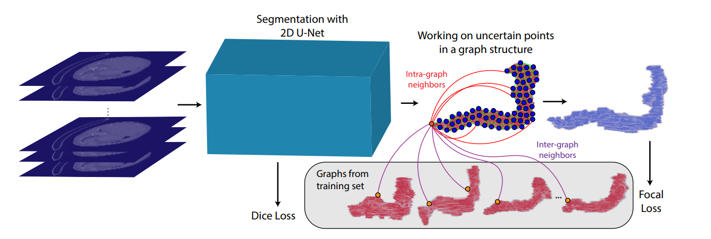

# Uncertainty-Based Dynamic Graph Neighborhoods For Medical Segmentation

Implementation of Uncertainty-Based Dynamic Graph Neighborhoods For Medical Segmentation https://arxiv.org/abs/2108.03117 in Pytorch and Pytorch Geometric.

This work is accepted for publication in the PRedictive Intelligence in MEdicine
(PRIME) workshop Springer proceedings in conjunction with MICCAI 2021.


Please contact demiruf17@itu.edu.tr or ozera17@itu.edu.tr for further details. 




# Overview

> In recent years, deep learning based methods have shown
success in essential medical image analysis tasks such as segmentation.
Post-processing and refining the results of segmentation is a common
practice to decrease the misclassifications originating from the segmentation network. In addition to widely used methods like Conditional Random Fields (CRFs) which focus on the structure of the segmented volume/area, a graph-based recent approach makes use of certain and uncertain points in a graph and refines the segmentation according to a small
graph convolutional network (GCN). However, there are two drawbacks
of the approach: most of the edges in the graph are assigned randomly
and the GCN is trained independently from the segmentation network.
To address these issues, we define a new neighbor-selection mechanism
according to feature distances and combine the two networks in the training procedure. According to the experimental results on pancreas segmentation from Computed Tomography (CT) images, we demonstrate
improvement in the quantitative measures. Also, examining the dynamic
neighbors created by our method, edges between semantically similar
image parts are observed. The proposed method also shows qualitative
enhancements in the segmentation maps, as demonstrated in the visual
results. 

# Requirements and Usage
## Requirements 
 You can install the requirements for this project by using requirements.txt

 ```sh
 $ conda install --file requirements.txt
```
## Data preparation
[NIH Pancreas](https://wiki.cancerimagingarchive.net/display/Public/Pancreas-CT
) dataset is used during experiments. We shared some processed samples for inference codes but for training you have to preprocess all samples with given script below.

```sh
 $ python medical_preprocessing.py
```
## Inference
Model and samples need to be downloaded from [here](https://web.itu.edu.tr/ozera17/DGMS.rar). After downloading it, place them as following:

Model --> pancreas_ct/

Data : \
pancreas --> "pancreas_ct/pancreas_npy_3d/test/" \
pancreas label --> "pancreas_ct/pancreas_label_npy_3d/test/"


Then run `test.py`

In order to get the masked result, which means the actual segmentation where you can see the pancreas, run `get_pancreas_pred.py`.

Finally, to generate the .jpg file, use `show_pred.py` (Modify line 13 and 22 accordingly)


# Citation
```latex
@misc{demir2021uncertaintybased,
      title={Uncertainty-Based Dynamic Graph Neighborhoods For Medical Segmentation}, 
      author={Ufuk Demir and Atahan Ozer and Yusuf H. Sahin and Gozde Unal},
      year={2021},
      eprint={2108.03117},
      archivePrefix={arXiv},
      primaryClass={eess.IV}
}
```
